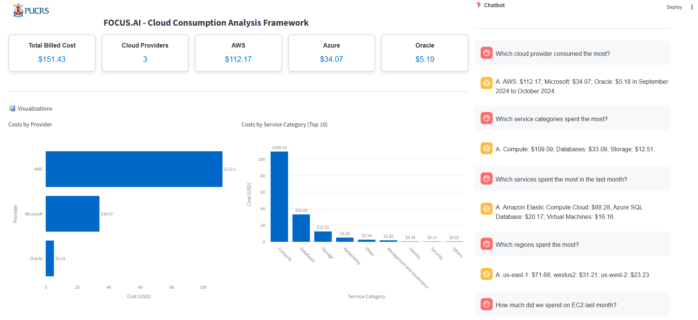

# FOCUS.AI - Cloud Consumption Analysis Framework

A Framework for Natural Language Interaction with Cloud Billing Data.
This repository contains the implementation of the FOCUS.AI framework, designed to simplify the analysis and management of cloud billing data in multi-cloud environments. By leveraging the FinOps Open Cost and Usage Specification (FOCUS) and Large Language Models (LLMs), this framework enables both technical and non-technical users to interact with standardized billing data through natural language queries, promoting FinOps principles and data-driven decision-making.



## Table of Contents

- [Overview](#overview)
- [Features](#features)
- [Architecture](#architecture)
- [Installation](#installation)
- [Usage](#usage)
- [Scripts](#scripts)
- [Case Study](#case-study)
- [Results](#results)
- [Contributing](#contributing)
- [License](#license)
- [References](#references)

## Overview
Managing cloud costs in multi-cloud environments is challenging due to the heterogeneity of billing data formats across providers like AWS, Azure, Google Cloud, and Oracle Cloud. The FOCUS.AI framework addresses this by integrating the FOCUS specification for data standardization with a natural language interface powered by LLMs. It provides an automated ETL pipeline, a SQL database for data storage, and a Streamlit-based web interface with pre-defined visualizations and a chatbot for dynamic queries.

The framework aims to:
- Simplify cloud cost analysis for FinOps professionals.
- Enable non-technical users to query billing data using natural language.
- Provide a scalable, customizable "Build" approach for multi-cloud cost management.
- Promote transparency and accountability in cloud resource usage.

## Features
- Automated ETL Pipeline: Extracts, transforms, and loads billing data from multiple cloud providers into a standardized FOCUS format.
- Text-to-SQL Conversion: Uses LLMs (e.g., GPT-3.5-turbo, Llama-4) to convert natural language queries into executable SQL queries.
- Web Interface: Built with Streamlit, featuring:
- Pre-defined dashboards with interactive visualizations (bar charts, pie charts, treemaps).
- A chatbot for real-time natural language interaction with billing data.
- Multi-Cloud Support: Compatible with AWS, Azure, Google Cloud, and Oracle Cloud billing data in FOCUS format.
- High Accuracy: Achieves up to 89% accuracy in Text-to-SQL conversion, validated with real-world FinOps use cases.
- Extensible: Open-source codebase allows for customization and integration with additional data sources or LLMs.

## Architecture
The framework's architecture is composed of three main modules:
### Data Collection and Standardization (data_processing.py):
- Collects raw billing data in CSV or Parquet format.
- Normalizes data into the FOCUS format using an ETL pipeline.
- Stores data in a DuckDB relational database.
- Processes tags (e.g., tag_application, tag_environment) into dedicated columns.
### Text-to-SQL Processing (langchain_query_EN.py):
- Pre-processes user queries to handle synonyms, jargon, and context.
- Uses LLMs via LangChain to convert natural language into SQL queries.
- Executes queries on the DuckDB database and formats results into natural language responses.
- Logs performance metrics (e.g., token counts, execution times) for debugging.
### Front-End Interface (visualization_v3_EN.py):
- Provides a Streamlit-based web interface with:
- Summary cards for metrics (e.g., total cost, costs by provider).
- Visualizations (e.g., cost by provider, service category, application).
- A chatbot for interactive queries with conversation history.
- Uses Plotly for interactive charts and custom CSS for styling.

## Installation
### Prerequisites
- Python 3.8+
- Dependencies listed in requirements.txt
- API keys for LLM providers (e.g., OpenAI or Groq)
- Sample billing data in FOCUS format (e.g., from FOCUS Sample Data)
### Steps
1. Clone the Repository:
   ```bash
   git clone https://github.com/your-username/focus-ai.git
   cd focus-ai
   ```
2. **Set Up a Virtual Environment**:
   ```bash
   python -m venv venv
   source venv/bin/activate  # On Windows: venv\Scripts\activate
   ```

3. **Install Dependencies**:
   ```bash
   pip install -r requirements.txt
   ```

4. **Configure Environment Variables**:
   Create a `.env` file in the root directory with your LLM API keys:
   ```plaintext
   OPENAI_API_KEY=your_openai_api_key
   # GROQ_API_KEY=your_groq_api_key
   ```

5. **Prepare Billing Data**:
   Place your FOCUS-compliant billing data (Parquet or CSV) in a directory (e.g., `data/input/`) and update the `INPUT_DIRECTORY` in `data_processing.py`.

6. **Run the Application**:
   ```bash
   streamlit run visualization_v3_EN.py
   ```

   Access the web interface at `http://localhost:8501`.

## Usage

1. **Data Processing**:
   - Run `data_processing.py` to consolidate billing data into a single Parquet file and load it into DuckDB.
   - Example:
     ```bash
     python data_processing.py
     ```

2. **Web Interface**:
   - Launch the Streamlit app to view dashboards and interact with the chatbot.
   - Dashboards display metrics like total billed cost, costs by provider, and breakdowns by application or environment.
   - Use the chatbot to ask questions like:
     - "Which cloud provider consumed the most?"
     - "How much did we spend on EC2 last month?"
     - "What are the top 3 applications by cost?"

3. **Query Processing**:
   - The chatbot processes queries using LLMs to generate SQL, execute them, and return natural language responses.
   - Conversation history is maintained during the session for context-aware follow-up questions.

## Scripts
- **`data_processing.py`**: Handles ETL for billing data, consolidating Parquet files and loading them into DuckDB.
- **`langchain_query_EN.py`**: Manages Text-to-SQL conversion using LLMs, with pre-processing and response formatting.
- **`visualization_v3_EN.py`**: Implements the Streamlit web interface with dashboards and chatbot functionality.

## Case Study
The framework was validated using a sample dataset from the FinOps Foundation ([FOCUS Sample Data](https://github.com/FinOps-Open-Cost-and-Usage-Spec/FOCUS-Sample-Data)). Twelve FinOps-relevant questions were tested, including:
- Which cloud provider consumed the most?
- Which services spent the most in the last month?
- How much did we spend on EC2 and S3?
- What are the top 3 environments by cost?
The framework achieved an average Text-to-SQL accuracy of 84.25%, with the Llama-4 model reaching 89%. The web interface provided intuitive visualizations and accurate responses, demonstrating usability for FinOps professionals.
## Results
| LLM                     | Accuracy |
|-------------------------|----------|
| gemma2-9b-it            | 81%      |
| GPT-3.5-turbo           | 86%      |
| llama-3.1-8b-instant    | 81%      |
| llama-4-maverick-17b-128| 89%      |

The framework offers a cost-effective alternative to commercial FinOps tools, with high accuracy and flexibility for multi-cloud environments.

## Contributing
Contributions are welcome! To contribute:
1. Fork the repository.
2. Create a feature branch (`git checkout -b feature/your-feature`).
3. Commit your changes (`git commit -m 'Add your feature'`).
4. Push to the branch (`git push origin feature/your-feature`).
5. Open a Pull Request.

Please follow the [Code of Conduct](CODE_OF_CONDUCT.md) and report issues via the [Issues](https://github.com/your-username/focus-ai/issues) tab.

## License
This project is licensed under the MIT License. See the [LICENSE](LICENSE) file for details.

## References
- FinOps Foundation, "The Unifying Format for Cloud Billing Data," [https://focus.finops.org/](https://focus.finops.org/)
- FOCUS Sample Data, [https://github.com/FinOps-Open-Cost-and-Usage-Spec/FOCUS-Sample-Data](https://github.com/FinOps-Open-Cost-and-Usage-Spec/FOCUS-Sample-Data)
- LangChain Documentation, [https://python.langchain.com/](https://python.langchain.com/)
- Streamlit Documentation, [https://docs.streamlit.io/](https://docs.streamlit.io/)
---
*Built by Gilberto N. Junior at PUCRS, Brazil.*
